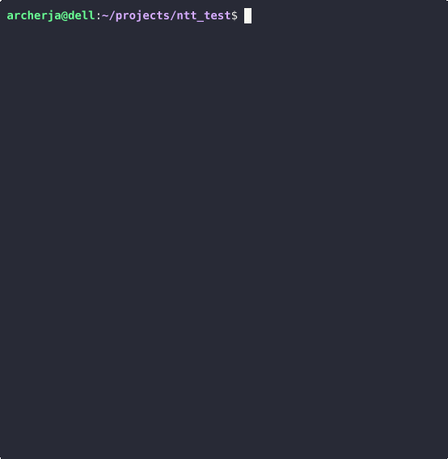

# ntt.py - NAME THAT TUNE

This python3 script will create a menu from a local directory, using up to 9 different top level directories, to create a simple "Name That Tune" game. It allows you to hear the first 5 seconds of the song, then select options until the answer is requested. You can manually keep track of team names and scores (2 teams).

It works really well with compilation albums (various artists). I use it with a Raspberry Pi connected to my TV. I use a 128 GB SD card, without a GUI, and a display resolution of 640x480 60Hz.

### NEW!
* An intro song can be added at the start banner, so that the volume can be adjusted before the game begins.
* Will now track all played songs, in each menu category, so that it can not be played again.
* If all songs in a menu category have been played, that menu can not be picked anymore.

## Some of the options

* Automatically creates a configuration file, if needed.
* Reads a music directory using the first 9 music sub-folders listed.
* Scans each folder, and the first level directory becomes a separate menu option.
* It is set at a 5 second audio clip, from the beginning of the song.
* It also allows for 10 extra seconds to be added. (cheat)
* Can play the whole song, with or without revealing the artist and title.
* Play a random song.
* Override mode, for continuous, random play. (speed round)
* Two team hide/show (with team naming and scoring).

#### Note:
* Settings for number of clip seconds, team names and scores, music directory, intro song, etc. can be changed in the configuration file (ntt.ini).

## Background

***This script requires:***

 -  [mpv](https://mpv.io) to play the songs, hide the artist/title, and read mp3 tags.

MPV has a neat feature that allows you to hear a song, without showing anything on the screen. It also lets you open the audio file paused, and only play a certain number of seconds of the file. You can also read the embedded mp3 tags within the audio file.

## Wiki Links

 - [Installation](https://github.com/archerja/ntt/wiki/Installation)
 - [How to Play](https://github.com/archerja/ntt/wiki/How-To-Play)
 - [Example Setup on RPi 3B+](https://github.com/archerja/ntt/wiki/Example-Setup-on-Raspberry-Pi-3B)
 - [Release History](https://github.com/archerja/ntt/wiki/Release-History)

## Author

Joseph Archer (C) 2021

## License

The code is covered by the MIT.

